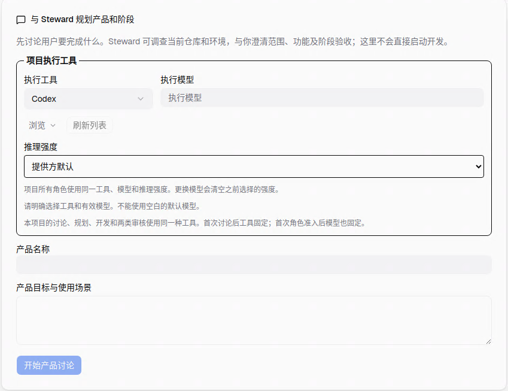
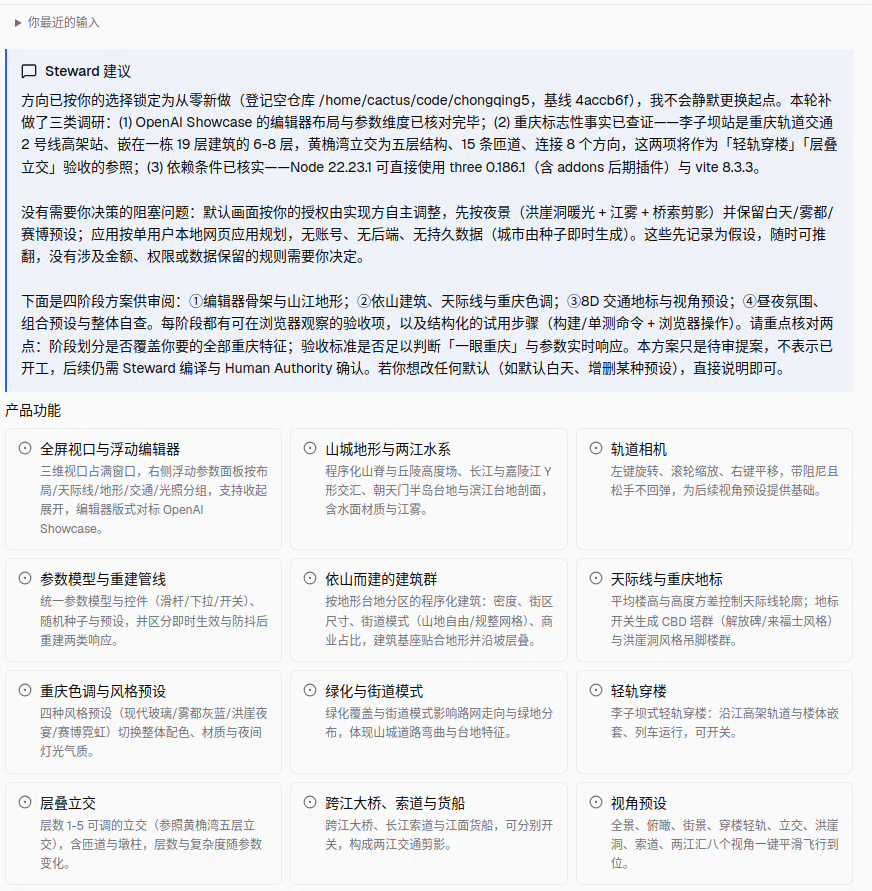
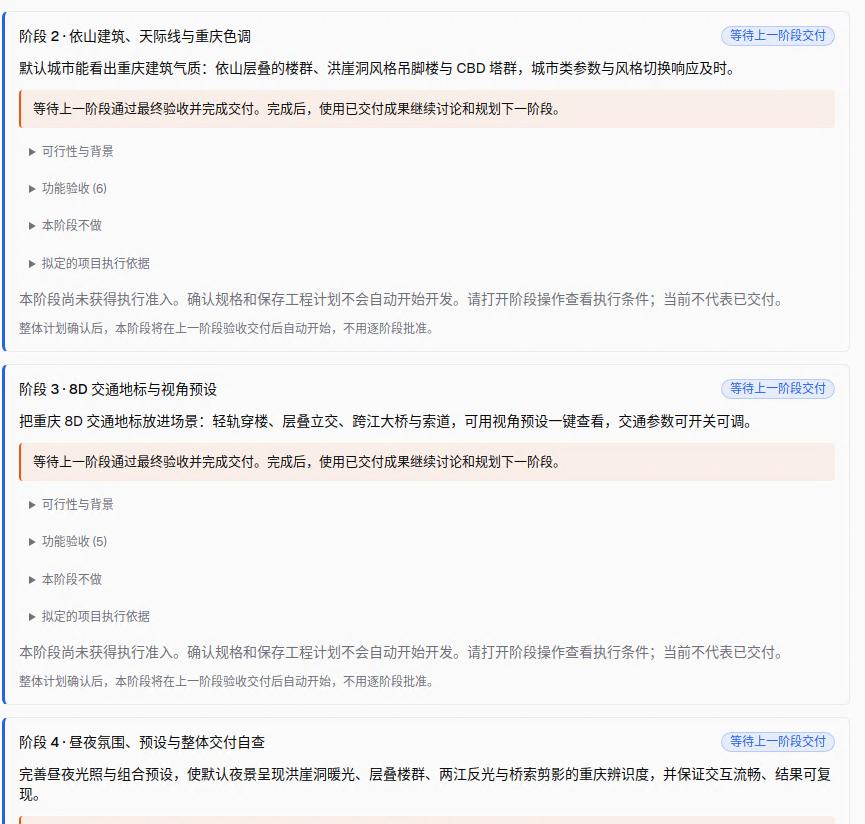
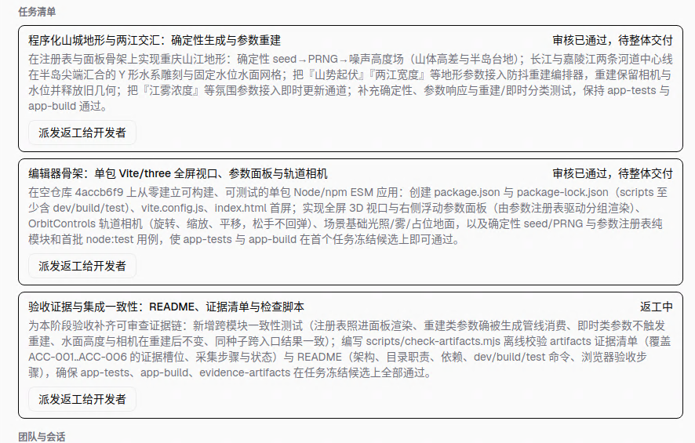
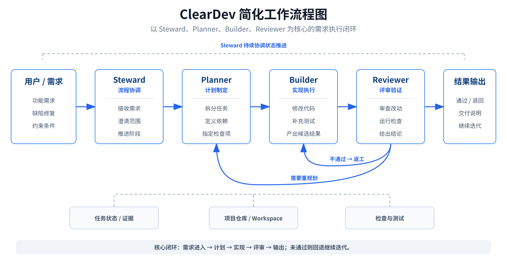
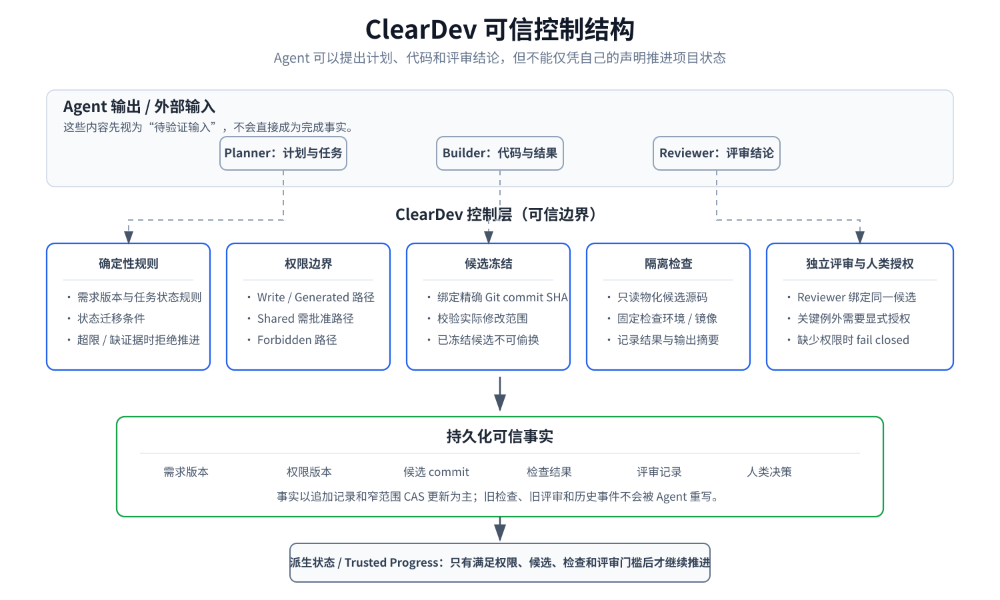

# ClearDev

ClearDev 是一个正在开发中的多 Agent 软件开发控制系统，目标是把复杂的软件需求拆成可追踪、可验证的开发任务，并让不同 Agent 在明确的权限、状态和验收边界下协作。

## 当前状态

ClearDev 已有完整的开发版本和实际产品界面。**本仓库目前公开的是第一阶段源码，尚未涵盖完整开发版本的全部内容。**

下面的截图展示了当前完整开发版本的产品界面。界面和功能仍在持续迭代，部分展示内容可能尚未同步到本仓库。

## 产品界面示意

### 项目创建面板

选择项目执行工具、模型和推理强度，填写产品名称与目标，开始与 Steward 讨论需求。

### 需求讨论面板

Steward 结合仓库与环境调查，梳理产品功能、阶段方案和需要确认的问题。

### 阶段目标面板

按阶段查看目标、功能验收和范围边界，了解各阶段的交付依赖与当前状态。

### 单个阶段任务面板

查看单个阶段的任务清单、审核状态与派工入口，跟踪各项任务的推进情况。

## ClearDev 想解决的问题

在较长的软件开发任务中，一个 Coding Agent 同时负责理解需求、修改代码和自我验收，容易出现上下文漂移、修改范围失控以及“已经完成”和“已经验证”混在一起的问题。

ClearDev 希望把这些事情拆开：

- 把需求保存成可以追踪的版本；
- 把复杂需求拆成明确的开发任务；
- 为 Agent 限定可以修改的范围和操作边界；
- 把测试结果、审核结果和 Git 提交保存为可检查的事实；
- 让计划、执行和验收由不同职责完成；
- 由普通程序而不是 Agent 自己决定状态是否可以继续前进；
- 给使用者提供简短、明确的项目状态，而不是要求阅读大量聊天记录。

## 工作流程

## 可信控制结构

ClearDev 不把 Agent 的自我声明直接当成完成事实。计划、代码和评审输出需要经过普通程序控制的权限、候选冻结、检查、评审和持久化证据门槛，项目状态再从这些事实中派生。

## 仓库内容

当前公开仓库主要保留：

- `backend/`：Go 后端、状态控制、存储、适配器和相关核心逻辑；
- `frontend/`：桌面端和相关前端代码；
- `packages/`：项目中的共享包和其他客户端代码；
- `scripts/`：源码构建或运行过程中仍然需要的脚本；
- `test/`：仍保留在源码快照中的测试内容；
- `LICENSE`：项目许可证；
- `THIRD_PARTY_NOTICES.md`：上游来源与第三方声明。

公开仓库不会包含内部开发路线、阶段计划、开发交接记录、发布操作手册等开发过程资料。

## 关于上游项目

ClearDev 最初基于 [Agent Orchestrator](https://github.com/Untrivial-ai/agent-orchestrator) 的代码继续开发。

当前源码中仍可能看到 Agent Orchestrator 的模块路径、包名、命名和实现。这些内容会随着 ClearDev 的独立开发逐步整理，不代表 ClearDev 是 Agent Orchestrator 的官方版本，也不代表原项目维护者对 ClearDev 提供赞助或背书。

更详细的来源与许可证说明见 [THIRD_PARTY_NOTICES.md](THIRD_PARTY_NOTICES.md)。

## 许可证

本仓库保留 Apache License 2.0 许可证，详见 [LICENSE](LICENSE)。

## 说明

当前阶段以公开核心源码为主。等项目结构、运行方式和发布流程稳定后，再补充面向使用者的安装、使用和贡献文档。
